<!-- Header Banner -->

  

 

&nbsp;
&nbsp;
&nbsp;

---

## 👨‍💻 About Me

> **Solutions Architect** building production-grade cloud infrastructure & security — from bare metal to Kubernetes — with multi-cloud expertise, AI integration, and full-stack IaC automation. Everything is code, nothing is manual.

- 🌍 Based in the **Greater Toronto Area, Canada**
- ☁️ **Multi-Cloud** — certified across **AWS**, **Azure**, and **GCP** with hands-on production experience
- 🏗️ I build and operate a **30+ host homelab** spanning Proxmox VE, Kubernetes, and GPU-accelerated AI
- 🔒 Zero secrets in code · Zero SSH · Zero trust — security-first architecture everywhere
- 🧊 Immutable infrastructure advocate — **Talos Linux** for K8s, **Fedora CoreOS** for AI workloads
- 🤖 **AI Practitioner** — local LLM inference with semantic vector memory on self-hosted GPU infrastructure
- 📱 **Unified Endpoint Management Expert** — enterprise MDM across Apple, Android, Samsung, and Windows
- 🌐 Bilingual — fluent in **English** and **Spanish**

---

## 🚀 Featured Projects

<table>
<tr>
<td width="50%" valign="top">

### [☸️ k8s-homelab](https://github.com/Rodiel-Lezcano/k8s-homelab)
**Production-Grade Kubernetes on Proxmox**

6-node HA cluster running Talos Linux — immutable OS, eBPF networking, GitOps delivery, and multi-layer disaster recovery.

  
  
  

`Zero SSH` · `19 Network Policies` · `3-Replica Storage` · `Velero DR`

**Stack:** Cilium · Longhorn · Rancher · Traefik · Fleet GitOps · Velero · Prometheus · Grafana · cert-manager

</td>
<td width="50%" valign="top">

### [🏗️ infraops](https://github.com/Rodiel-Lezcano/infraops)
**Enterprise-Grade IaC for Proxmox Homelab**

Full lifecycle infrastructure automation — Terraform provisioning, Ansible config management, Vault secrets, Jenkins CI/CD, dual-SIEM security operations.

  
  
  

`30+ Hosts` · `5 TF Modules` · `2-Min VM Deploy` · `Zero Secrets in Code`

**Stack:** Proxmox · Jenkins · Gitea · Wazuh · Splunk · Authentik · Headscale · NetBox · n8n

</td>
</tr>
<tr>
<td width="50%" valign="top">

### [🦞 openclaw](https://github.com/Rodiel-Lezcano/openclaw)
**GPU-Accelerated Personal AI Infrastructure**

Self-hosted AI platform on Fedora CoreOS — local LLM inference with semantic long-term memory, GPU offloading, custom Prometheus exporter, and zero cloud dependency.

  
  
  

`1-3s Inference` · `768-dim Vector Memory` · `27+ Agent Skills` · `3 Dashboards`

**Stack:** Docker · NVIDIA Container Toolkit · SQLite-vec · Prometheus · Grafana · Promtail

</td>
<td width="50%" valign="top">

### ☁️ AWS Labs

**[aws-serverless-lab](https://github.com/Rodiel-Lezcano/aws-serverless-lab)** — Complete serverless CRUD API using Lambda, API Gateway, and DynamoDB

**[aws-bedrock-genai-workshop](https://github.com/Rodiel-Lezcano/aws-bedrock-genai-workshop)** — No-code GenAI RAG workflow using Amazon Bedrock, OpenSearch, and S3

  
  
  

</td>
</tr>
</table>

---

## 📊 Infrastructure at a Glance

| Metric | Value |
|:-------|:------|
| 🖥️ **Managed Hosts** | 30+ (VMs, LXC, K8s nodes, bare metal) |
| ☸️ **Kubernetes Nodes** | 6 (3 CP + 3 Worker) — Talos Linux |
| 🧱 **Terraform Modules** | 5 production-ready, reusable |
| 🛡️ **Security Agents** | 14 Wazuh + 13 Splunk forwarders |
| 🔐 **Network Policies** | 19 CiliumNetworkPolicies |
| 📈 **Prometheus Rules** | 18 alerting rules, 10 ServiceMonitors |
| 🤖 **AI Agent Skills** | 27+ (1Password, GitHub, Hue, Sonos, Whisper…) |
| 📚 **Documentation** | 700KB+ across 29 guides |

---

## 🛠️ Tech Stack

**Infrastructure & Orchestration**

  
  
  
  
  
  

**Networking & Security**

  
  
  
  
  

**Observability & Monitoring**

  
  
  
  
  

**CI/CD & GitOps**

  
  
  
  

**Cloud & AI**

  
  
  
  
  

**Operating Systems & Platforms**

  
  
  
  
  

---

## 🏆 Certifications

<strong>🛠️ DevOps & Platform Engineering</strong>

 

  
  
  
  

<strong>☁️ Google Cloud Certifications</strong>

 

  
  
  
  
  

<strong>☁️ Google Cloud Skill Badges (10)</strong>

 

  
  
  
  
  
  
  
  
  
  

<strong>🔶 AWS Certifications</strong>

 

  

<strong>🔶 AWS Cloud Skill Badges (16)</strong>

 

  
  
  
  
  
  
  
  
  
  
  
  
  
  
  
  

<strong>📱 Enterprise Mobility Management (6)</strong>

 

  
  
  
  
  
  

---

## 📊 GitHub Stats

  
  

  

  

---

  Built with ☕ and too many VMs — <a href="https://www.linkedin.com/in/rodiellezcano">Let's connect</a>

